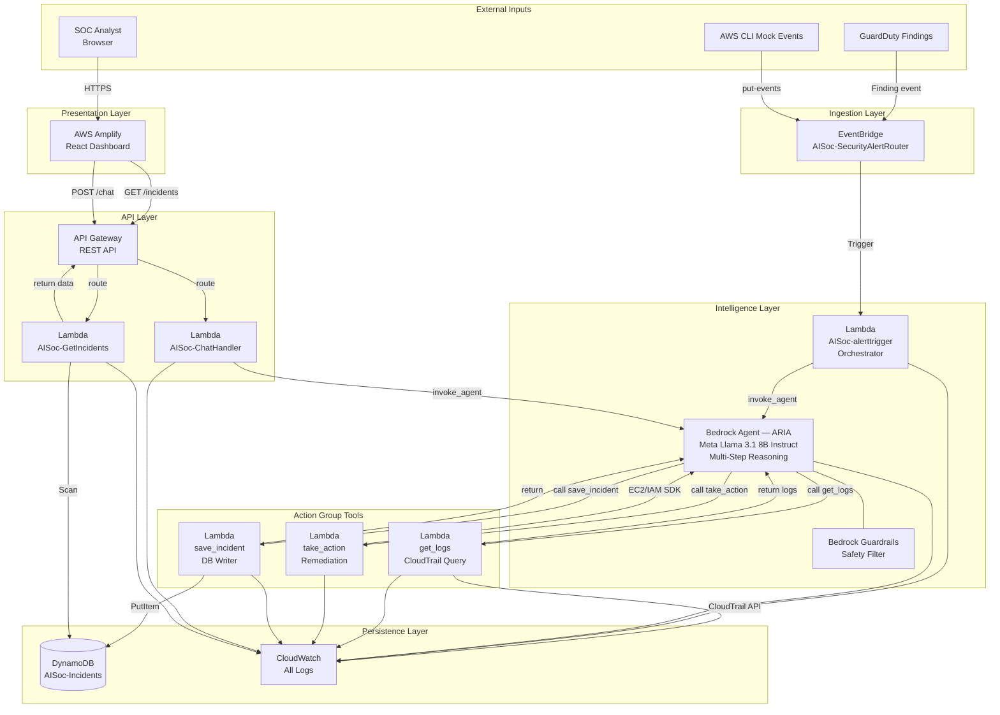
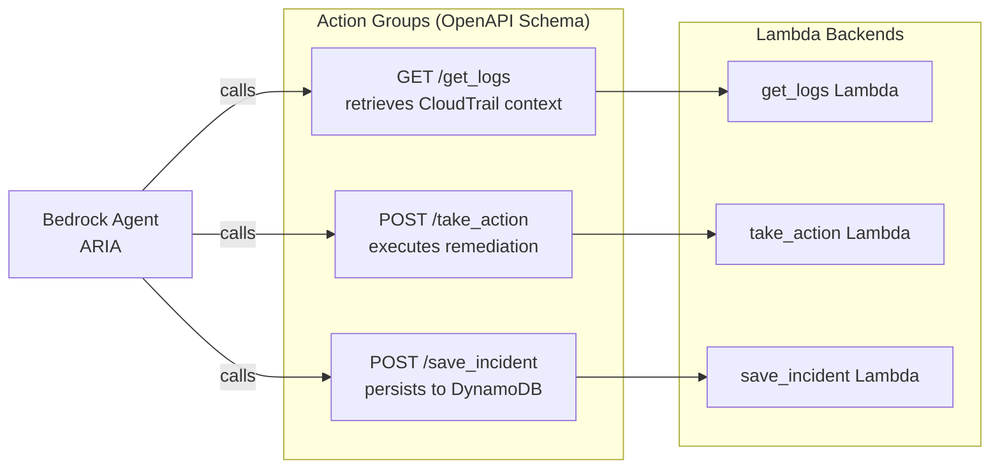
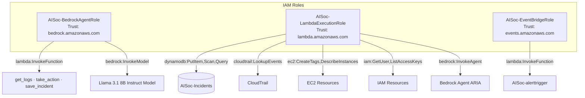
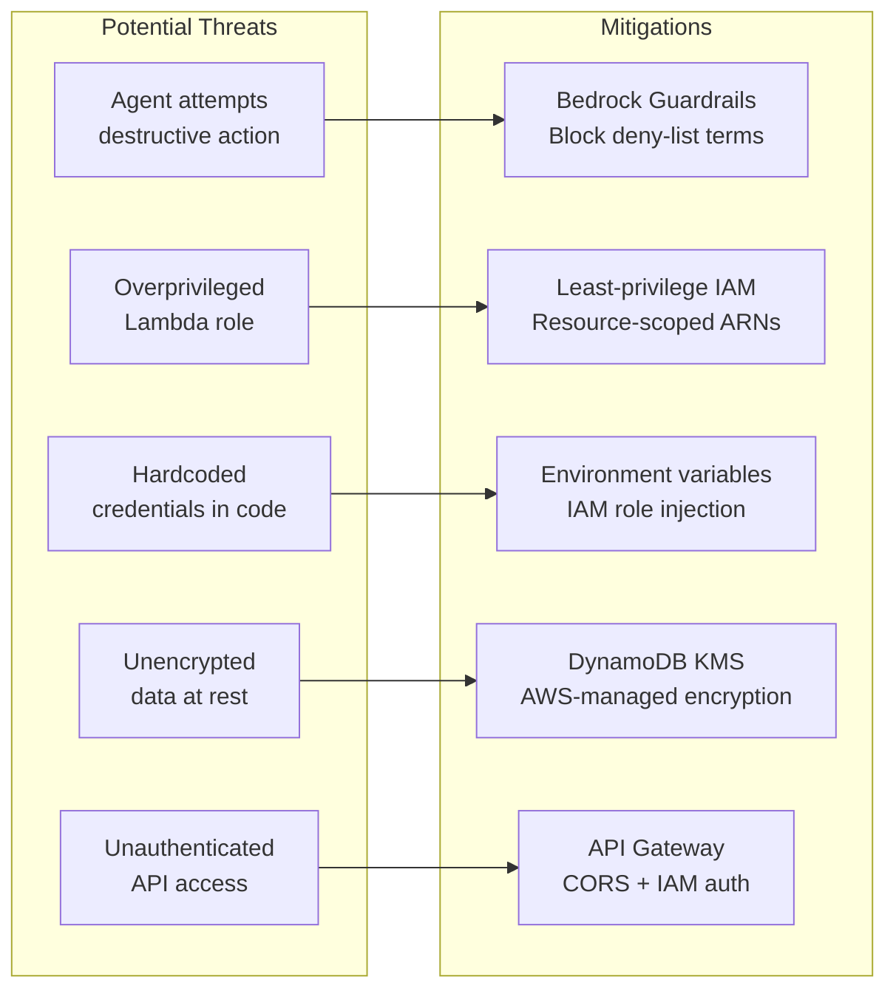

# 🏗️ AI SOC for AWS — Architecture Deep Dive

> **Project Space 8.0 | Team 14**  
> Complete technical architecture reference for the AI-Powered Security Operations Center

---

## 1. Architecture Philosophy

The AI SOC system is built on four core architectural principles:

| Principle | Implementation |
|-----------|---------------|
| **Serverless-first** | Zero EC2 instances. 100% managed services. No capacity planning, no patching. |
| **Event-driven** | Amazon EventBridge as the nervous system. All components react to events. |
| **Least-privilege IAM** | Every service has its own dedicated IAM role with only the permissions it needs. |
| **AI-native design** | The reasoning engine is the primary control plane — not rule-based scripts. |

---

## 2. Four-Layer Architecture

```
┌─────────────────────────────────────────────────────────────────────┐
│  LAYER 1 — INGESTION LAYER                                          │
│  Amazon GuardDuty  →  Amazon EventBridge                            │
│  Mock JSON events  →  EventBridge Rule: AISoc-SecurityAlertRouter   │
├─────────────────────────────────────────────────────────────────────┤
│  LAYER 2 — INTELLIGENCE LAYER                                        │
│  Lambda: AISoc-alerttrigger                                         │
│    ↓                                                                │
│  Amazon Bedrock Agent (ARIA — Meta Llama 3.1 8B Instruct)           │
│    ↓ multi-step reasoning                                           │
│  Bedrock Guardrails (safety enforcement)                            │
├─────────────────────────────────────────────────────────────────────┤
│  LAYER 3 — ACTION LAYER                                             │
│  Lambda: get_logs  │  Lambda: take_action  │  Lambda: save_incident │
│  (Action Groups registered in Bedrock Agent)                        │
├─────────────────────────────────────────────────────────────────────┤
│  LAYER 4 — PERSISTENCE & PRESENTATION LAYER                         │
│  Amazon DynamoDB (AISoc-Incidents table)                            │
│  Amazon API Gateway  →  AWS Amplify (React Dashboard)               │
│  Amazon CloudWatch (all Lambda + Agent logs)                        │
└─────────────────────────────────────────────────────────────────────┘
```

---

## 3. Component Interaction Map



---

## 4. Bedrock Agent Architecture

### 4.1 Agent Configuration

| Parameter | Value |
|-----------|-------|
| Agent Name | `ai-soc-analyst` |
| Foundation Model | `meta.llama3-8b-instruct-v1:0` |
| Agent ID | `UOSNOXLWJD` |
| Production Alias ID | `0YQZSD4HA6` (ChatHandler) |
| EventBridge Alias ID | `02PQZAH3MY` (AlertTrigger) |
| Region | `us-east-1` |
| Orchestration | Fully managed multi-step tool-use |

### 4.2 Action Group Design



### 4.3 Reasoning Loop (ReAct Pattern)

```
Thought: I need to investigate this SSH brute force alert on i-0abc123
Action: get_logs(resource_id="i-0abc123", resource_type="EC2", time_window_hours=24)
Observation: [3 CloudTrail events from external IPs, 2 privileged actions detected]

Thought: Logs confirm suspicious activity from external IPs — this is real
Action: take_action(action_type="apply_quarantine_tag", resource_id="i-0abc123", severity="HIGH")
Observation: {"success": true, "action_taken": "apply_quarantine_tag"}

Thought: Action successful. Now persist the full incident record.
Action: save_incident(incident_id="INC-A1B2C3D4", alert_type="UnauthorizedAccess:EC2/SSHBruteForce", ...)
Observation: {"status": "SAVED", "incident_id": "INC-A1B2C3D4"}

Final Answer: === ARIA INCIDENT ANALYSIS REPORT === ...
```

---

## 5. DynamoDB Design

### 5.1 Access Patterns

| Access Pattern | Query Type | Index Used |
|----------------|------------|------------|
| Get all incidents (dashboard) | `Scan` with `Limit` | Primary table |
| Get incidents by severity | `Query` on `severity-index` | GSI |
| Get open incidents | `Query` on `status-index` | GSI |
| Get incident by ID | `GetItem` | Primary table |

### 5.2 TTL Strategy

All items have a `ttl` attribute set to 90 days from creation. DynamoDB automatically deletes expired items, ensuring:
- Storage stays within Free Tier limits
- Audit trail maintained for 90 days
- No manual cleanup required

---

## 6. API Gateway Design

```
Base URL: https://1wls2elsr0.execute-api.us-east-1.amazonaws.com/prod

Routes:
┌──────────────────────────────────────────────────────────┐
│  OPTIONS /incidents  → CORS preflight (200 OK)           │
│  GET     /incidents  → AISoc-GetIncidents Lambda         │
│                        Returns: incidents[], stats{},    │
│                                 graphData[], pieData[]   │
│                                                          │
│  OPTIONS /chat       → CORS preflight (200 OK)           │
│  POST    /chat       → AISoc-ChatHandler Lambda          │
│                        Body: { message, session_id }     │
│                        Returns: { response, session_id } │
└──────────────────────────────────────────────────────────┘
```

---

## 7. IAM Architecture

### 7.1 Role Map



### 7.2 Permission Boundaries

| Role | Max Permissions | Why Limited |
|------|----------------|-------------|
| BedrockAgentRole | Cannot call DynamoDB directly | Only tools can persist data — agent cannot bypass |
| LambdaExecutionRole | `ec2:CreateTags` only (no terminate/stop/delete) | Safe quarantine — cannot destroy resources |
| EventBridgeRole | Single Lambda target | Cannot invoke arbitrary resources |

---

## 8. Security Controls



---

## 9. CloudWatch Observability

All components write structured logs to CloudWatch:

| Log Group | What's Logged |
|-----------|---------------|
| `/aws/lambda/AISoc-alerttrigger` | EventBridge payload, Agent session ID, full response |
| `/aws/lambda/AISoc-ChatHandler` | User message, Agent response, session state |
| `/aws/lambda/AISoc-GetIncidents` | DynamoDB scan results, stats computed |
| `/aws/lambda/get_logs` | CloudTrail API calls, mock data flag, pattern analysis |
| `/aws/lambda/save_incident` | DynamoDB PutItem result, incident ID |
| `/aws/lambda/take_action` | Action type, resource, execution result |
| `BedrockAgent/AISoc` | Full agent trace — reasoning steps, tool calls, token usage |

**Log Retention:** All Lambda log groups set to 30-day retention.

---

## 10. Cost Architecture (Free Tier)

| Service | Free Tier Limit | Project Usage | Cost |
|---------|----------------|---------------|------|
| AWS Lambda | 1M requests/month | ~500 invocations | $0 |
| Amazon DynamoDB | 25 GB + 25 WCU + 25 RCU | < 1 MB + minimal | $0 |
| Amazon EventBridge | 1M events/month | < 100 events | $0 |
| API Gateway | 1M calls/month | < 1000 calls | $0 |
| Amazon CloudWatch | 5 GB logs/month | < 10 MB | $0 |
| AWS Amplify | Free Tier hosting | Static build | $0 |
| Amazon Bedrock (Llama 3.1 8B Instruct) | Pay-per-token | ~1000 calls × 2K tokens | ~$2–5 |
| Amazon GuardDuty | 30-day free trial | Trial period | $0 |

**Estimated total cost: $0–$5 for the full development and demo lifecycle.**

---

*— AI SOC for AWS · Project Space 8.0 · Team 14 —*
