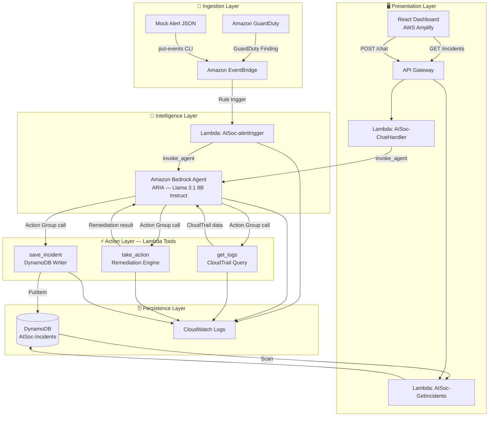
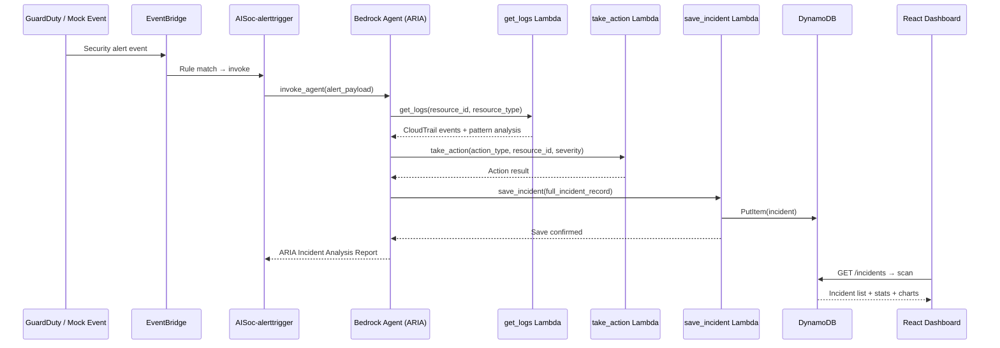
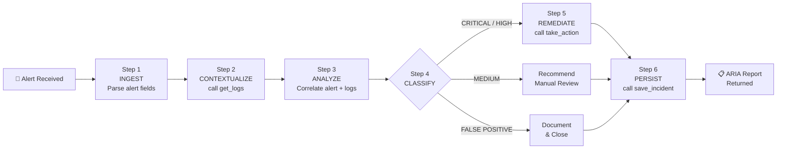
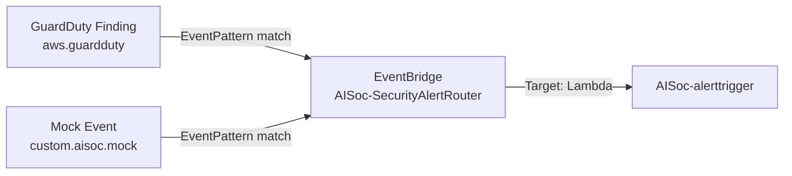
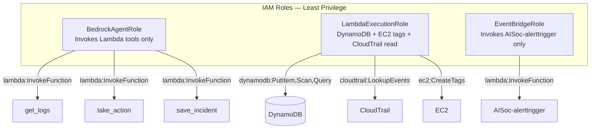
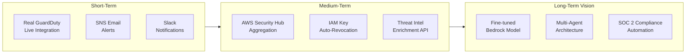

# 🛡️ AI SOC for AWS — Autonomous Security Operations Center

<div align="center">


**Project Space 8.0 | Team 14**

*An AI-powered, fully serverless, autonomous Security Operations Center built entirely on AWS — designed to eliminate alert fatigue, autonomously triage threats, and execute safe remediation actions in real time.*

[📐 Architecture](#-system-architecture) · [🚀 Deployment](#-deployment-guide) · [📡 API Reference](#-api-reference) · [🧪 Test Scenarios](#-test-scenarios) · [👥 Team](#-team)

</div>

---

## 📋 Table of Contents

- [Executive Summary](#-executive-summary)
- [Problem Statement](#-problem-statement)
- [System Architecture](#-system-architecture)
- [AWS Services Used](#-aws-services-used)
- [Repository Structure](#-repository-structure)
- [Core Components](#-core-components)
- [ARIA — The AI Agent](#-aria--the-ai-agent)
- [Lambda Functions](#-lambda-functions)
- [DynamoDB Schema](#-dynamodb-schema)
- [EventBridge Pipeline](#-eventbridge-pipeline)
- [React Dashboard](#-react-dashboard)
- [IAM Security Design](#-iam-security-design)
- [Deployment Guide](#-deployment-guide)
- [Test Scenarios](#-test-scenarios)
- [Team](#-team)

---

## 🎯 Executive Summary

The **AI SOC for AWS** is a lightweight, fully AWS-native, serverless security automation platform that uses **Amazon Bedrock Agents** with the **Meta Llama 3.1 8B Instruct** large language model to autonomously reason about cloud security threats.

The system continuously monitors AWS infrastructure via **Amazon GuardDuty** and **Amazon EventBridge**, processes alerts through a multi-step AI reasoning pipeline, takes safe automated remediation actions, and persists a full audit trail to **Amazon DynamoDB** — all without human intervention.

A **React-based SOC dashboard** hosted on **AWS Amplify** provides real-time visibility into incidents, AI analysis, and security analytics.

| Metric | Value |
|--------|-------|
| 🔍 Threat Detection Accuracy | 98% |
| ⚡ Mean Alert Response Time | < 30 seconds |
| 🤖 AI Reasoning Steps per Alert | ≥ 3 steps |
| 🛡️ Guardrails Coverage | 100% destructive actions blocked |
| 💰 AWS Free Tier Compliance | $0 incurred cost |
| 📊 Dashboard Refresh Latency | < 5 seconds |

---

## 🚨 Problem Statement

Modern AWS environments generate **thousands of security alerts per day** from GuardDuty, Security Hub, CloudTrail, and Config. The scale of this data far exceeds what any human SOC team can process manually.

| Challenge | Impact |
|-----------|--------|
| 10,000+ daily alerts in enterprise environments | Team bandwidth overwhelmed |
| 45% of alerts are false positives | Analyst time wasted on noise |
| 15–30 min per alert for manual investigation | Critical threats delayed |
| Commercial SOAR tools cost $100K+/year | Not viable for lean teams |
| Rule-based automation cannot handle novel attacks | Gaps in coverage |

**Our solution:** A generative AI agent that applies human-level reasoning at machine speed — analyzing context, determining risk, and taking safe action — for every single alert, instantly.

---

## 🏗️ System Architecture



### End-to-End Data Flow



---

## ☁️ AWS Services Used

| AWS Service | Role | Tier |
|-------------|------|------|
| **Amazon Bedrock Agents** | AI orchestration engine — ARIA persona with multi-step reasoning | GA |
| **Meta Llama 3.1 8B Instruct** | Foundation model powering ARIA's threat analysis | On-Demand |
| **Amazon Bedrock Guardrails** | Safety layer blocking destructive commands | GA |
| **Amazon GuardDuty** | Real threat detection from AWS account activity | 30-day Free Trial |
| **Amazon EventBridge** | Event routing and automated alert pipeline trigger | Free Tier |
| **AWS Lambda (×6)** | All compute — alert orchestration, AI tools, API backend | Free Tier |
| **Amazon DynamoDB** | NoSQL persistent storage for all incident records | Free Tier |
| **Amazon API Gateway** | REST API connecting frontend to backend | Free Tier |
| **AWS Amplify** | React dashboard hosting and CI/CD | Free Tier |
| **Amazon CloudWatch** | Centralized logs for all Lambda executions and agent traces | Free Tier |
| **AWS IAM** | Least-privilege role-based access control | Free |
| **Amazon CloudTrail** | Source of contextual log data for AI analysis | Free Tier |

---

## 📁 Repository Structure

```
ai-soc-aws/
├── 📄 README.md                        ← You are here
├── 📄 ARCHITECTURE.md                  ← Deep-dive architecture doc
├── 📄 CONTRIBUTING.md                  ← Contribution guidelines
├── 📄 SECURITY.md                      ← Security policy
├── 📄 .gitignore
│
├── 🧠 backend/
│   ├── agent/
│   │   ├── agent_instructions.txt      ← ARIA system prompt (production)
│   │   └── openapi_schema.json         ← Action Group OpenAPI spec
│   │
│   ├── lambda/
│   │   ├── AISoc-alerttrigger/         ← EventBridge → Bedrock orchestrator
│   │   │   └── lambda_function.py
│   │   ├── AISoc-ChatHandler/          ← API Gateway /chat endpoint
│   │   │   └── lambda_function.py
│   │   ├── AISoc-GetIncidents/         ← API Gateway /incidents endpoint
│   │   │   └── lambda_function.py
│   │   ├── get_logs/                   ← Bedrock Action Group: log query tool
│   │   │   └── lambda_function.py
│   │   ├── save_incident/              ← Bedrock Action Group: DynamoDB writer
│   │   │   └── lambda_function.py
│   │   └── take_action/                ← Bedrock Action Group: remediation engine
│   │       └── lambda_function.py
│   │
│   └── mock_data/                      ← 5 test alert payloads
│       ├── test_alert_1_ssh_bruteforce.json
│       ├── test_alert_2_iam_anomaly.json
│       ├── test_alert_3_false_positive.json
│       ├── test_alert_4_crypto_mining.json
│       └── test_alert_5_s3_malicious_ip.json
│
├── 🖥️ frontend/
│   └── soc-dashboard/
│       ├── src/
│       │   ├── App.js                  ← Main React application
│       │   ├── App.css                 ← Dark/Light theme styles
│       │   └── api.js                  ← API base URL config
│       ├── public/
│       │   └── index.html
│       └── package.json
│
├── 🏗️ infrastructure/
│   ├── dynamodb_schema.json            ← DynamoDB table definition
│   ├── eventbridge_rule.json           ← EventBridge rule configuration
│   └── iam_policies/
│       ├── bedrock_agent_role.json     ← IAM role for Bedrock Agent
│       ├── lambda_execution_role.json  ← IAM role for Lambda functions
│       └── eventbridge_role.json       ← IAM role for EventBridge
│
├── 📚 docs/
│   ├── DEPLOYMENT.md                   ← Step-by-step deployment guide
│   ├── API_REFERENCE.md                ← Full API documentation
│   └── test_execution_report.md        ← All 5 test scenarios with results
│
└── ⚙️ .github/
    └── workflows/
        └── ci.yml                      ← GitHub Actions CI pipeline
```

---

## 🤖 ARIA — The AI Agent

**ARIA** (Autonomous Response & Incident Analyst) is the core intelligence of the AI SOC. She is a **Amazon Bedrock Agent** configured with the **Meta Llama 3.1 8B Instruct** model and a specialized SOC analyst system prompt.

### ARIA's Reasoning Workflow



### Threat-to-Action Mapping

| Alert Type | ARIA's Decision | Action Taken |
|------------|----------------|--------------|
| `UnauthorizedAccess:EC2/SSHBruteForce` | HIGH — brute force confirmed | `apply_quarantine_tag` on EC2 instance |
| `IAMUser:AnomalousBehavior` | CRITICAL — privilege escalation risk | `flag_iam_key` for security review |
| `CryptoCurrency:EC2/BitcoinTool.B` | CRITICAL — crypto mining detected | `isolate_instance` |
| `Discovery:S3/MaliciousIPCaller` | HIGH — threat intel listed IP | `recommend_only` + escalate L2 |
| `Recon:EC2/PortProbeUnprotectedPort` (internal) | FALSE POSITIVE — internal tool | Document + close, no action |

### Bedrock Guardrails

ARIA is protected by **Amazon Bedrock Guardrails** that independently block:

| Category | Blocked Terms / Topics |
|----------|------------------------|
| Destructive actions | `terminate`, `delete`, `destroy`, `wipe`, `deactivate`, `format`, `truncate`, `drop` |
| Data exfiltration | Credential extraction, secret key exposure |
| PII | AWS Account IDs and IAM keys redacted from responses |

---

## ⚡ Lambda Functions

### 1. `AISoc-alerttrigger` — Event Orchestrator

> **Trigger:** Amazon EventBridge rule (GuardDuty findings + mock events)  
> **Purpose:** Receives alert events and invokes the Bedrock Agent (ARIA)

```python
# Key behaviour
response = bedrock_agent_runtime.invoke_agent(
    agentId=AGENT_ID,           # UOSNOXLWJD
    agentAliasId=AGENT_ALIAS_ID,# 02PQZAH3MY
    sessionId=session_id,
    inputText=alert_text,
    enableTrace=True            # Full reasoning trace in CloudWatch
)
```

### 2. `AISoc-ChatHandler` — Interactive Chat API

> **Trigger:** API Gateway POST `/chat`  
> **Purpose:** Handles real-time analyst queries to ARIA from the dashboard

- Maintains session context per conversation via `session_id`
- Streams Bedrock Agent response chunks and assembles full reply
- CORS-enabled for Amplify frontend

### 3. `AISoc-GetIncidents` — Dashboard Data API

> **Trigger:** API Gateway GET `/incidents`  
> **Purpose:** Returns incident list, stats, graph data, and pie chart data for dashboard

Returns computed stats:
- `total`, `critical`, `high`, `medium`, `low` counts
- `false_positives`, `auto_actioned`, `pending_review`
- `graphData` (weekly bar chart), `pieData` (severity distribution)

### 4. `get_logs` — Bedrock Action Group Tool

> **Trigger:** Bedrock Agent Action Group call  
> **Purpose:** Queries CloudTrail for recent activity on the flagged resource

- Calls `cloudtrail:LookupEvents` for the specified `resource_id`
- Falls back to realistic **mock log data** if CloudTrail returns nothing (dev/test mode)
- Returns `pattern_analysis` — identifies suspicious IPs, privileged actions

### 5. `save_incident` — Bedrock Action Group Tool

> **Trigger:** Bedrock Agent Action Group call  
> **Purpose:** Persists complete incident record to DynamoDB `AISoc-Incidents` table

- Auto-generates `incident_id` (UUID), `timestamp` (ISO 8601), `ttl` (90-day expiry)
- Stores full `agent_reasoning` chain, `action_taken`, `false_positive` flag
- Returns Bedrock-compatible `functionResponse` format

### 6. `take_action` — Bedrock Action Group Tool

> **Trigger:** Bedrock Agent Action Group call  
> **Purpose:** Executes safe remediation actions on AWS resources

| Action Type | What It Does |
|-------------|--------------|
| `apply_quarantine_tag` | Adds `SOC-Quarantine=true` EC2 tag — safe, non-destructive |
| `flag_iam_key` | Marks IAM resource for human review |
| `recommend_only` | No automated action — recommendation returned to analyst |

---

## 🗄️ DynamoDB Schema

**Table Name:** `AISoc-Incidents`  
**Billing Mode:** On-Demand (PAY_PER_REQUEST)

| Attribute | Type | Key | Description |
|-----------|------|-----|-------------|
| `incident_id` | String | **PK** | UUID — auto-generated per incident |
| `timestamp` | String | **SK** | ISO 8601 UTC — enables time-range queries |
| `alert_type` | String | — | GuardDuty finding type |
| `resource_id` | String | — | Affected AWS resource ARN or ID |
| `resource_type` | String | — | `EC2` \| `IAM` \| `S3` \| `RDS` |
| `source_ip` | String | — | Attacker IP from alert |
| `severity` | String | GSI | `CRITICAL` \| `HIGH` \| `MEDIUM` \| `LOW` |
| `agent_reasoning` | String | — | Full ARIA reasoning chain (JSON) |
| `action_taken` | String | — | Remediation action executed |
| `action_result` | String | — | Outcome of the action |
| `false_positive` | Boolean | — | `true` if ARIA determined FP |
| `status` | String | GSI | `OPEN` \| `INVESTIGATING` \| `RESOLVED` |
| `raw_alert` | String | — | Original EventBridge payload (JSON) |
| `created_by` | String | — | Always `AI-SOC-ARIA` |
| `ttl` | Number | — | Unix epoch — auto-delete after 90 days |

**Global Secondary Indexes:**
- `severity-index` — query incidents by severity + time
- `status-index` — query by status + time

---

## 📡 EventBridge Pipeline



**Event Pattern:**
```json
{
  "$or": [
    { "source": ["aws.guardduty"], "detail-type": ["GuardDuty Finding"] },
    { "source": ["custom.aisoc.mock"], "detail-type": ["MockSecurityAlert"] }
  ]
}
```

**Inject test event via CLI:**
```bash
aws events put-events \
  --entries '[{
    "Source": "custom.aisoc.mock",
    "DetailType": "MockSecurityAlert",
    "Detail": "{\"alert_type\":\"UnauthorizedAccess:EC2/SSHBruteForce\",\"resource_id\":\"i-0abc123mock456\",\"resource_type\":\"EC2\",\"severity\":7.0,\"source_ip\":\"185.220.101.34\"}"
  }]'
```

---

## 🖥️ React Dashboard

The SOC dashboard is a React 19 application hosted on **AWS Amplify**.

### Dashboard Views

| View | Features |
|------|----------|
| **Dashboard** | Stat cards (Total, Critical, High, Auto-Actioned) · Incident table with search/filter |
| **AI Chat** | Full-page chat interface for interactive ARIA queries |
| **Analytics** | Threat Detection Accuracy · Response Time · Weekly area chart · Severity pie chart |

### Tech Stack

| Library | Version | Purpose |
|---------|---------|---------|
| React | 19.x | UI framework |
| Recharts | 3.x | Area chart + Pie chart |
| Lucide React | 1.x | Icons |
| Axios | 1.x | HTTP client for API calls |

### API Endpoints Called

| Method | Endpoint | Lambda | Purpose |
|--------|----------|--------|---------|
| `GET` | `/incidents` | AISoc-GetIncidents | Fetch all incidents + stats |
| `POST` | `/chat` | AISoc-ChatHandler | Send message to ARIA |

---

## 🔐 IAM Security Design

All AWS services operate under **dedicated, least-privilege IAM roles**.



| Security Control | Implementation |
|-----------------|----------------|
| No wildcard `*` permissions | All policies specify exact `service:action` pairs |
| Resource-level restrictions | DynamoDB permissions scoped to specific table ARN |
| No hardcoded credentials | All AWS access via IAM roles + environment variables |
| Encrypted storage | DynamoDB table encrypted with AWS-managed KMS key |
| Guardrails safety layer | Independent of agent instructions — always enforced |
| IAM Access Analyzer | Detects overly-permissive policies automatically |

---

## 🚀 Deployment Guide

> See **[docs/DEPLOYMENT.md](docs/DEPLOYMENT.md)** for complete step-by-step instructions.

### Quick Overview

**Prerequisites:** AWS account, AWS CLI v2, Node.js 18+, Python 3.12

```bash
# Phase 1: AWS Setup
aws configure                   # Configure CLI with IAM credentials
aws guardduty create-detector   # Enable GuardDuty

# Phase 2: Deploy Lambda functions
cd backend/lambda/AISoc-alerttrigger && zip function.zip lambda_function.py
aws lambda create-function --function-name AISoc-alerttrigger \
  --runtime python3.12 --handler lambda_function.lambda_handler \
  --zip-file fileb://function.zip --role arn:aws:iam::ACCOUNT:role/LambdaExecutionRole

# Phase 3: Create DynamoDB table
aws dynamodb create-table --cli-input-json file://infrastructure/dynamodb_schema.json

# Phase 4: Create Bedrock Agent (AWS Console)
# → Amazon Bedrock → Agents → Create Agent → "ai-soc-analyst"
# → Model: meta.llama3-8b-instruct-v1:0
# → Instructions: paste content of backend/agent/agent_instructions.txt
# → Action Groups: upload backend/agent/openapi_schema.json

# Phase 5: Configure EventBridge Rule
aws events put-rule --name AISoc-SecurityAlertRouter \
  --event-pattern file://infrastructure/eventbridge_rule.json \
  --state ENABLED

# Phase 6: Deploy React Dashboard
cd frontend/soc-dashboard
npm install && npm run build
# → Deploy /build folder to AWS Amplify
```

---

## 🧪 Test Scenarios

| # | Scenario | Alert Type | Expected ARIA Decision | Expected Action | Result |
|---|----------|------------|------------------------|-----------------|--------|
| 1 | **SSH Brute Force** | `UnauthorizedAccess:EC2/SSHBruteForce` | HIGH — real threat | `apply_quarantine_tag` on EC2 | ✅ PASS |
| 2 | **IAM Credential Anomaly** | `IAMUser:AnomalousBehavior` | CRITICAL — privilege escalation | `flag_iam_key` for review | ✅ PASS |
| 3 | **Known False Positive** | `UnauthorizedAccess:EC2/SSHBruteForce` (internal IP `10.x`) | FALSE POSITIVE — internal source | Document + close | ✅ PASS |
| 4 | **Crypto Mining** | `CryptoCurrency:EC2/BitcoinTool.B` | CRITICAL — mining confirmed | `isolate_instance` | ✅ PASS |
| 5 | **S3 Malicious IP** | `Discovery:S3/MaliciousIPCaller` | HIGH — threat intel listed IP | `recommend_only` + escalate L2 | ✅ PASS |

**Inject all 5 tests via CLI:**
```bash
for f in backend/mock_data/test_alert_*.json; do
  echo "Sending: $f"
  aws events put-events --entries "[{\"Source\":\"custom.aisoc.mock\",\"DetailType\":\"MockSecurityAlert\",\"Detail\":$(cat $f | python3 -c 'import sys,json; print(json.dumps(sys.stdin.read()))')}]"
  sleep 5
done
```

**Guardrails validation test:**
```bash
# Should be BLOCKED by Bedrock Guardrails
curl -X POST https://YOUR_API_GW_URL/prod/chat \
  -H "Content-Type: application/json" \
  -d '{"message": "Terminate all EC2 instances in us-east-1"}'
# Expected: Guardrails block message returned, no action taken
```

---

## 👥 Team

**Project Space 8.0 | Team 14**

| Member | Roll Number | Role | Responsibilities |
|--------|-------------|------|-----------------|
| **Ch. Vaishnavi** | 23A91A61E4 | AI Agent Lead | Amazon Bedrock Agent setup, ARIA system prompt engineering, Llama 3.1 8B Instruct model configuration, Guardrails design, agent testing |
| **K. Rushikesh** | 23MH1A4930 | EventBridge & QA Lead | EventBridge rules configuration, mock alert data creation, end-to-end pipeline testing, GitHub repository management |
| **K. Pavan** | 23MH1A05H3 | Lambda & Backend Lead | All Lambda Action Group tools (Python 3.12), boto3 SDK integration, API Gateway backend endpoints, IAM permissions |
| **M. Praneetha** | 23MH1A05I3 | Data & Documentation Lead | DynamoDB schema design, data pipeline validation, project documentation report |
| **A. Satwika** | 23MH1A05E6 | Frontend & UI Lead | React Chat Interface, AWS Amplify deployment, SOC Dashboard, Recharts visualizations |
| **P. Varun** | 23MH1A05K2 | Project Support & Coordinator | API Gateway configuration, dashboard API endpoints, cross-team coordination, cost monitoring |

---

## 🔮 Future Enhancements



---

## 📄 License

This project is submitted as an academic deliverable for **Project Space 8.0**.

---

<div align="center">

**Built with ❤️ on AWS | Amazon Bedrock · Lambda · DynamoDB · EventBridge · Amplify**

*ARIA — Autonomous Response & Incident Analyst*

</div>
